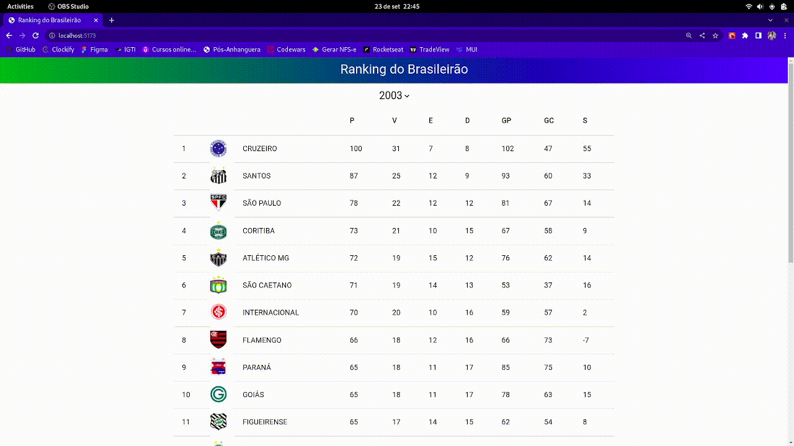

# RankingBrasileirao
Projeto desenvolvido durante o curso de Pós-Graduação e Desenvolvimento FullStack - IGTI/XP Educação

Este projeto react contém exemplos de uso do Styled-Components, Material UI.
